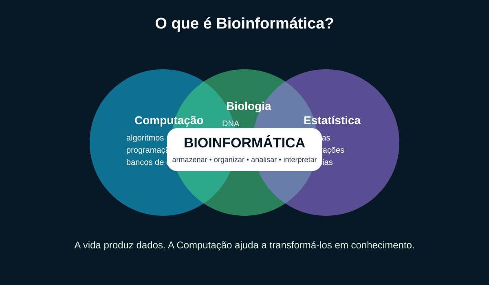
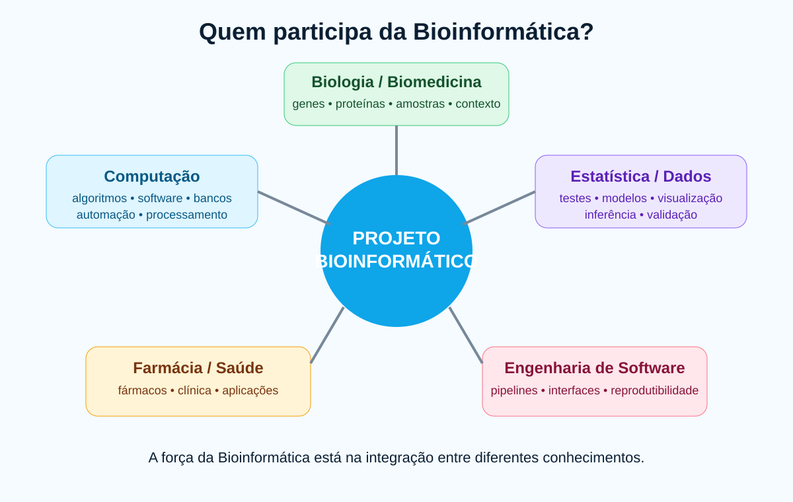
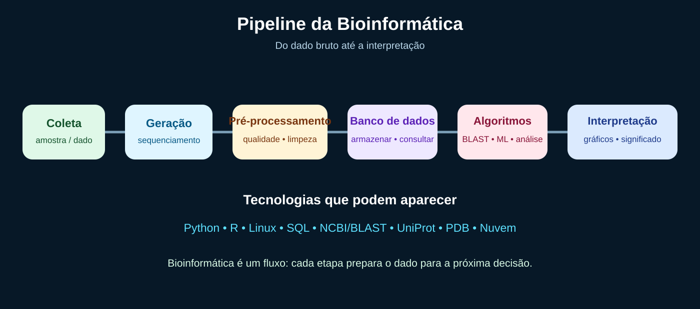
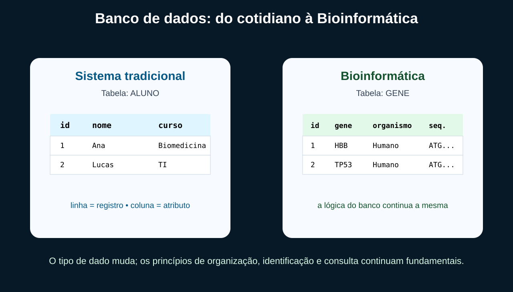
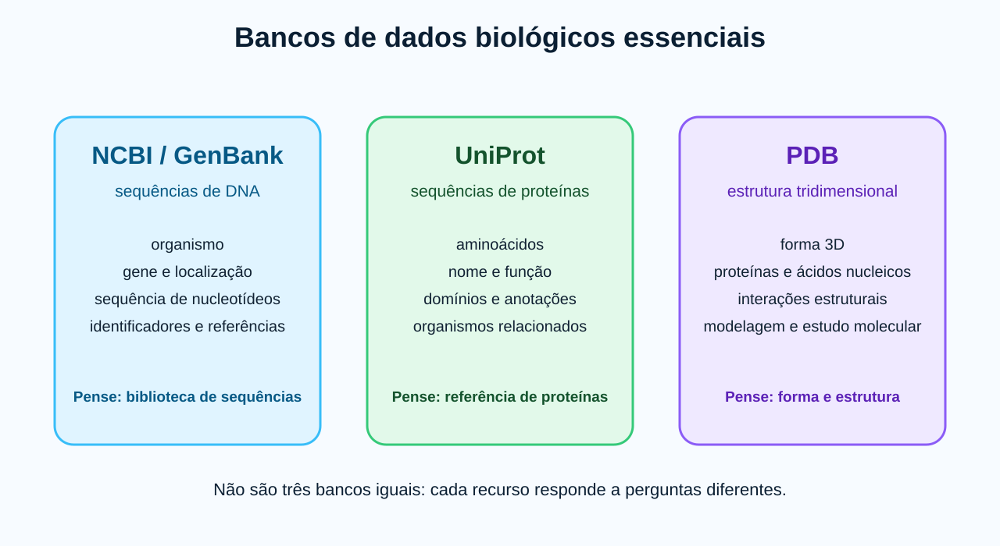

# Aula 04 - Bioinformática: quando diferentes áreas se encontram

**Duração:** 50 minutos  
**Público:** estudantes de Tecnologia e Saúde / Biomedicina  
**Abordagem:** introdutória, interdisciplinar, visual e prática  
**Pré-requisito:** nenhum conhecimento prévio de Python ou Bioinformática

[▶ Abrir a prática no Google Colab](https://colab.research.google.com/github/deniaulainfead23/bioinformatica/blob/main/aula04/aula04_colab.ipynb)

---

## Objetivos

Ao final da aula, o estudante deverá ser capaz de:

1. explicar o que é Bioinformática;
2. reconhecer seu caráter interdisciplinar;
3. identificar os conhecimentos trazidos por diferentes profissionais;
4. reconhecer tecnologias comuns da área;
5. compreender por que dados biológicos precisam ser armazenados e organizados;
6. relacionar bancos tradicionais a bancos biológicos;
7. executar uma análise computacional elementar de sequências.

---

# Roteiro de 50 minutos

## 0-8 min | O que é Bioinformática?

Pergunta de abertura:

> **O que acontece quando a quantidade de dados produzida pela Biologia se torna tão grande que uma pessoa não consegue mais analisá-la manualmente?**

A Bioinformática usa **Computação, Biologia, Estatística e Ciência de Dados** para obter, armazenar, organizar, processar e interpretar dados biológicos.



**Frase-chave:**

> **Bioinformática = dados biológicos + métodos computacionais + análise quantitativa + interpretação científica.**

---

## 8-16 min | Quem participa da Bioinformática?

A Bioinformática é interdisciplinar. Nenhum profissional precisa dominar sozinho todas as áreas.

- **Biologia / Biomedicina:** DNA, RNA, genes, proteínas, organismos, amostras e interpretação biológica.
- **Computação:** algoritmos, programação, bancos de dados, automação, processamento e software.
- **Estatística / Ciência de Dados:** comparação, visualização, modelos, incerteza e inferência.
- **Farmácia / Saúde:** aplicações clínicas, fármacos, alvos terapêuticos e contexto em saúde.
- **Engenharia de Software:** pipelines, reprodutibilidade, interfaces, documentação e qualidade.



---

## 16-24 min | Tecnologias envolvidas

Apresente o ecossistema sem aprofundar todas as ferramentas:

- Python e R;
- Linux;
- SQL e bancos de dados;
- NCBI, BLAST, UniProt e PDB;
- computação em nuvem;
- IA e Machine Learning em aplicações específicas.



O conceito importante é o **pipeline**:

```text
DADO BRUTO
    ↓
CONTROLE DE QUALIDADE
    ↓
PRÉ-PROCESSAMENTO
    ↓
ARMAZENAMENTO
    ↓
ALGORITMO / ANÁLISE
    ↓
VISUALIZAÇÃO
    ↓
INTERPRETAÇÃO
```

---

## 24-34 min | Conceitos iniciais de banco de dados

Faça a ponte com uma tabela conhecida.

- **Registro:** uma linha.
- **Atributo:** uma coluna.
- **Identificador:** valor que permite distinguir um registro.
- **Banco de dados:** conjunto organizado de dados para armazenamento, consulta e atualização.

Depois mostre a mesma lógica aplicada a genes, organismos e sequências.



Exemplo didático:

```text
GENE
id | gene | organismo | cromossomo | sequência | função
```

---

## 34-40 min | Bancos de dados biológicos

### NCBI / GenBank

Grande recurso para sequências de nucleotídeos e suas anotações.

### UniProt

Recurso de referência para sequências e anotações de proteínas.

### PDB

Repositório de estruturas tridimensionais de biomoléculas.



---

## 40-43 min | Onde entra o BLAST?

O BLAST compara uma sequência de interesse com sequências armazenadas em bancos de referência.

> **Analogia:** um buscador procura textos parecidos; o BLAST procura sequências biologicamente semelhantes.

Ele pode apoiar busca por homologia, anotação e identificação de sequências semelhantes.

---

## 43-46 min | Qualidade dos dados

Um algoritmo sofisticado não corrige automaticamente uma base ruim.

Problemas podem incluir:

- dados ausentes;
- inconsistências;
- ruído;
- redundância;
- formatos diferentes.

O pré-processamento prepara os dados antes das análises.

---

## 46-50 min | Prática rápida em Python

Abra o [notebook no Google Colab](https://colab.research.google.com/github/deniaulainfead23/bioinformatica/blob/main/aula04/aula04_colab.ipynb).

A prática parte do princípio de que o estudante **não sabe Python**. Cada comando possui comentários explicando o que faz e por que está sendo usado.

Pergunta final:

> **Como transformar uma sequência de letras em variáveis que um algoritmo consiga analisar?**

---

## Materiais

- [Notebook comentado](aula04_colab.ipynb)
- [Atividade](atividade.md)
- [Gabarito comentado](gabarito.md)
- [Script Python](pratica.py)
- [Base didática](dados/sequencias_demo.csv)
- [Revisão da aula](REVISAO.md)

## Observação científica

As sequências utilizadas na prática são sintéticas e didáticas. Os cálculos podem estar matematicamente corretos sem sustentar uma inferência biológica sobre organismos reais.