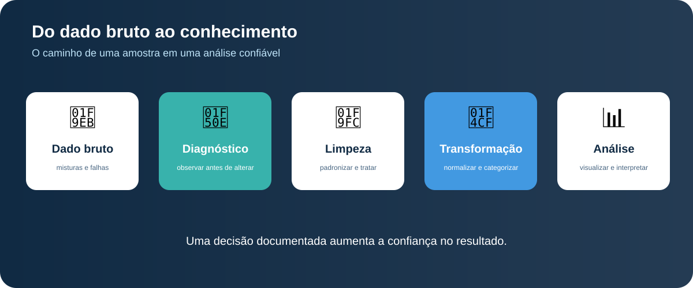
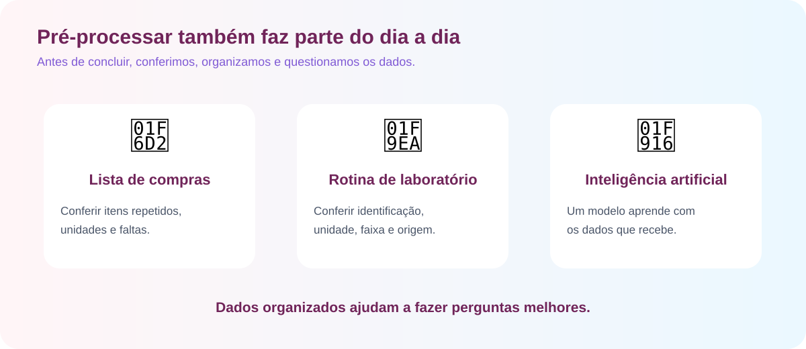

# Prática: Pré-processamento de dados laboratoriais

Atividade prática para estudantes de **Biomedicina e Farmácia**, realizada no Google Colab.

> Os dados são sintéticos e servem somente para fins didáticos. Não representam pacientes, exames reais ou resultados clínicos.

## Acesso rápido

- [Notebook no GitHub](./Oficina_Preprocessamento_Biomedicina_Farmacia.ipynb)
- [Abrir no Google Colab](https://colab.research.google.com/github/deniaulainfead23/bioinformatica/blob/main/praticas/Oficina_Preprocessamento_Biomedicina_Farmacia.ipynb)

## Proposta

Os grupos simulam uma equipe que recebeu uma base de amostras laboratoriais com problemas de qualidade. Eles precisam observar, justificar decisões e preparar os dados antes da análise.

**Dado bruto → diagnóstico → limpeza → validação → transformação → visualização → interpretação**

## Divisão dos grupos

Cada grupo deve ter pelo menos quatro estudantes:

| Grupo | Responsabilidade |
|---|---|
| 1 | Diagnosticar ausências, tipos e inconsistências |
| 2 | Padronizar textos e tratar dados ausentes |
| 3 | Validar números, identificar suspeitas e duplicidades |
| 4 | Normalizar, discretizar e criar gráficos |

## Conceitos praticados

- dados ausentes e conversão de texto para número;
- padronização de acentos, espaços e capitalização;
- duplicidades e valores discrepantes;
- normalização Min-Max e discretização;
- gráficos de barras, boxplot e dispersão;
- interpretação responsável dos resultados.

## Orientação

A atividade foi pensada para uma aula objetiva, prática e acessível pelo celular. Os estudantes devem registrar as respostas nas áreas indicadas e explicar a decisão tomada em cada etapa.

> Pré-processar não é esconder problemas. É identificar, documentar e tratar os dados com justificativa.

